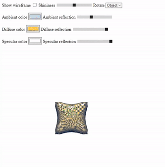

# Phong Rendering Example
Phong rendering example for my homework

# Project
Options available in html file, you can rotate either light or object depends on selected thing by dragging mouse cursor
P.S: Gif doesn't show the the final version
